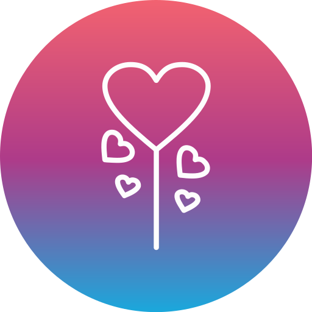

# 익명 커뮤니티 서버 개발 프로젝트
## 프로젝트 소개
* 익명 커뮤니티(게시글, 채팅, 이미지 업로드) 서비스를 위한 RESTful API와 소켓 통신 서버를 개발합니다.

## 주요 기능
* JWT를 활용한 액세스 토큰으로 사용자 인증/인가 수행
* 리프레쉬 토큰으로 액세스 토큰 갱신
* 모든 사용자에게 노출되는 게시글 작성/삭제
* 다른 사용자의 게시글에 댓글 작성/삭제
* 사용자 간 1:1 채팅, 1:n 채팅
* 이미지 업로드
* 불량 유저를 신고 및 차단, 격리할 수 있는 시스템